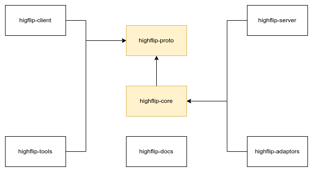

HIGHFLIP
===================
HIGHFLIP是一个顶层联邦学习互通服务，用于解决异构联邦平台间相互通信的问题。名字来自于英文**HIGH**
layer **F**ederated **L**earning **I**ntercommunication **P**rotocol的缩写.

# 项目介绍

HIGHFLIP项目是用于解决异构的联邦学习平台互通的问题，通过统一不同平台使用方式的方法，
达到在使用的层面实现无差异访问，使用可适配的客户端与对方进行互通。

# 框架介绍

# 目录结构

- highflip-proto

  highflip协议定义工程，这里使用protobuf+grpc对highflip协议进行定义。
  此工程可以直接编译成jar文件，用于java的客户端和服务端进行实现。
  对于其他语言的实现，可以通过proto文件直接编译成对应语言的实现客户端。

- highflip-core

  核心对象和流程定义工程，这里定义了服务端的server和adaptor所使用的关键对象和流程。

- highflip-server

  highflip服务端的实现工程，这里使用了java语言实现的highflip协议的服务端，可以支持adaptor的动态扩展能力。

- highflip-client

  highflip客户端的实现工程，这里通过java语言对proto生成的client进行包装，便于调用使用。

- highflip-vendor

  highflip的厂商适配工程目录，其中包含了个厂商的adaptor、client、plugin的实现。
  其中demo工程用于演示如何实现方式。

- highflip-doc

  highflip的文档工程，用于生成highflip的官方使用手册。

- highflip-build

  highflip的编译环境镜像工程，用于生成可编译次工程的开发镜像。

# 编译条件

- Open JDK == 1.11
- Maven >= 3.5
- Protobuf >= 3.12
- gRPC-Java

# 贡献名单

- chenzhiyu(quby@sina.com)

# 版本信息

- 1.0.0
