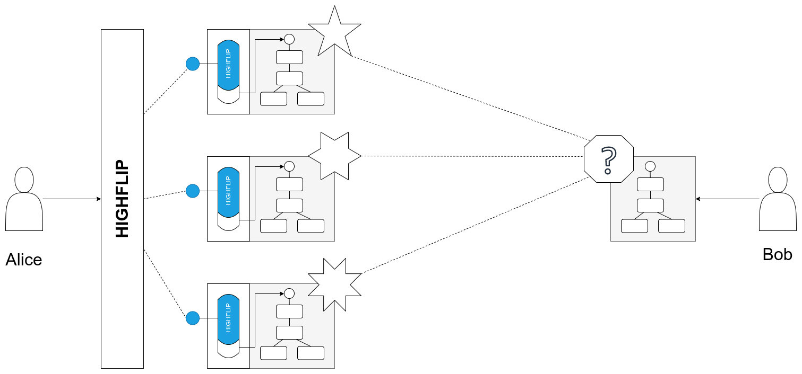

HIGHFLIP
===================================================
HIGHFLIP is named by capital letters of **HIGH** layer **F**ederated **L**earning **I**ntercommunication **P**rotocol

# Introduction

HIGHFLIP means to use the simplest way to build connection between heterogeneous
federated learning platform at high hierarchy.

# Architecture

# Directory

- highflip-core

contains HIGHFLIP essential core object definitions, includes protocol definition, adaptor interface,
data model, intermediate objects, which used in the interaction between adaptor and highflip engine.

- highflip-server

contains HIGHFLIP main server implementation, which based on spring boot framework, and used jpa as unified
storage interface. gRPC is used as definition of interaction interface.

- highflip-client
- highflip-doc

Document, which is written in Markdown language, used to introduction project hierarchy, user manuals,
interface definitions and adaptation method.

- highflip-vendor
- highflip-build

# Build Requirement

- JDK 11
- Maven >= 3.5
- Protobuf 3
- gRPC-Java

# Owners

- chenzhiyu (quby@sina.com)

# Version

- 1.0.0

