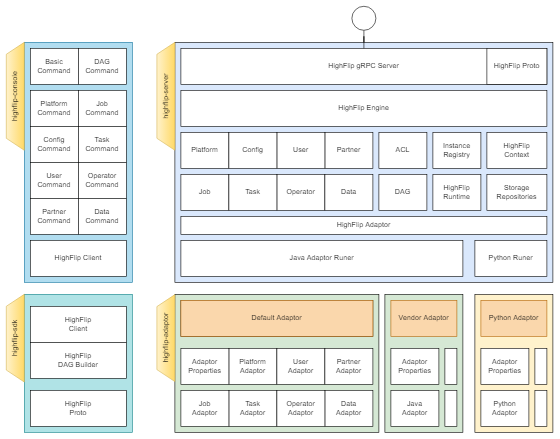

HIGHFLIP SERVER
=====================================================

## 框架介绍



highflip-server，是highflip协议的java版本的服务端实现，整体是基于spring boot框架撰写，对外通过gRPC对外进行提供服务。

- 服务的网络部分，使用的是LogNet的spring grpc组件，对外暴露1个grpc接口，默认情况下，使用的是8751端口。

- 服务的存储部分，使用的是spring data jpa存储底层，可以适配绝大多数的数据库。在默认情况下，使用的是H2嵌入式数据库，不需要配置数据源，
即可以运行。

- 服务的适配部分，是通过不同语言的实现的适配器（adaptor），动态的配置和加载不同的适配器。可以通过“highflip.server.adaptor.path”配置项目
进行设置所需要加载的适配器。默认支持的是java版本的适配器，后续可以支持python，或者其它语言实现的适配器。

## 如何使用
- 通过bash直接运行jarfile
```bash
java -jar highflip-server-*.jar --highflip.server.adaptor.path=<filepath_adaptor.jar>
```

- 通过docker启动服务镜像
```bash
docker run -it highflip-server:1.0.0-SNAPSHOT
```

## 常用配置选项
|选项名称|类型| 默认值  | 描述   |
|-------|----|------|------|
|grpc.port|int|8751  | 服务监听端口 |
|grpc.security.auth.enabled|boolean|false|是否开启身份验证|
|highflip.server.adaptor.path|string| |适配器jar所在路径|
|logging.root.level|string| |日志显示等级|


## 默认的适配器
- PlatformAdaptor: DefaultPlatformAdaptor
- AuthenticationAdaptor: ByPassAuthenticationAdaptor
- JobAdaptor: DumbJobAdaptor
- TaskAdaptor: DumbTaskAdaptor
- DataAdaptor: FixedSingleDataAdaptor
- PartnerAdaptor: FixedPartnerDataAdaptor
- AlgorithmAdaptor: AlgorithmNameListAdaptor
- UserAdaptor: FixedSingleUserAdaptor


